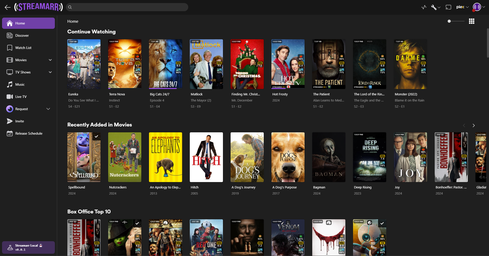

**Streamarr** is a an open source web application meant to wrap an existing *Arr ecosystem such as **[Sonarr](https://sonarr.tv/)**, **[Radarr](https://radarr.video/)**, **[Overserr](https://overseerr.dev/)**, and **[Plex](https://www.plex.tv/)** enabling a smooth user friendly experience. 

## Current Features

- Admin Centre for easy to manage settings and users.
- A robust and customizable invite management system.
- A fully featured release schedule with integrations to Sonarr and Radarr.
- Integrated with Overseerr for a complete user experience for streaming, requesting and reporting issues.
- A fully customizable user permission system.
- Built as a PWA so users can access on-the-go or on a PC.
- Supports most* Plex library types: Movies, TV Shows, Music and live TV.
- An integrated Help Center for clear user instructions and support.

## Planned Features

- An integrated notification system with custom notification triggers.
- Enable Customization of the Help Center.
- Fully customizable email newsletters and communications.

With more features to come! Check out the [issue tracker](https://github.com/nickelsh1ts/streamarr/issues) to see what's been requested already.

## Getting Started

Check out our docs for help, instructions, and info on how to install, setup and customize your experience.

https://docs.streamarr.dev

## Preview

## Support

- Check out our [documentation](https://docs.streamarr.dev) before asking for help. The answer might also be in our [issue tracker](https://github.com/nickelsh1ts/streamarr/issues).
- Support is also provided on [Discord](https://discord.gg/Streamarr).
- You can reach out to us on the [GitHub Discussions](https://github.com/nickelsh1ts/streamarr/discussions).
- Bug reports and feature requests can be submitted with [GitHub Issues](https://github.com/nickelsh1ts/streamarr/issues).

## API Documentation

TBA

## Community

TBA

## Contributing

TBA

## Contributors

<!-- ALL-CONTRIBUTORS-LIST:START - Do not remove or modify this section -->
<!-- prettier-ignore-start -->
<!-- markdownlint-disable -->

<!-- markdownlint-restore -->
<!-- prettier-ignore-end -->

<!-- ALL-CONTRIBUTORS-LIST:END -->
