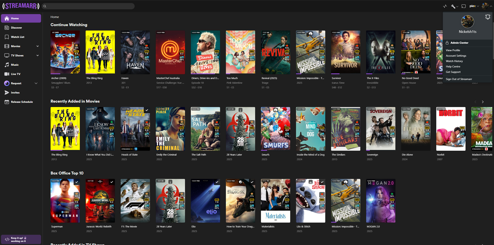
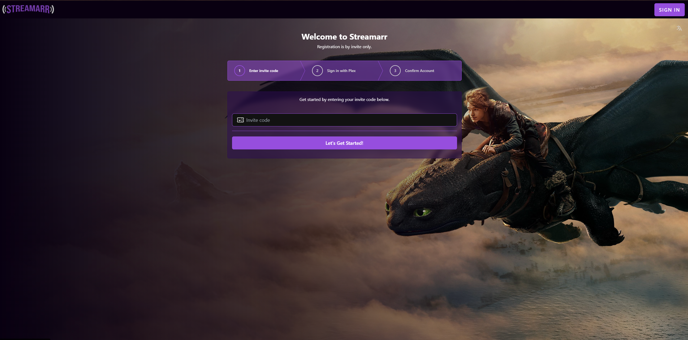
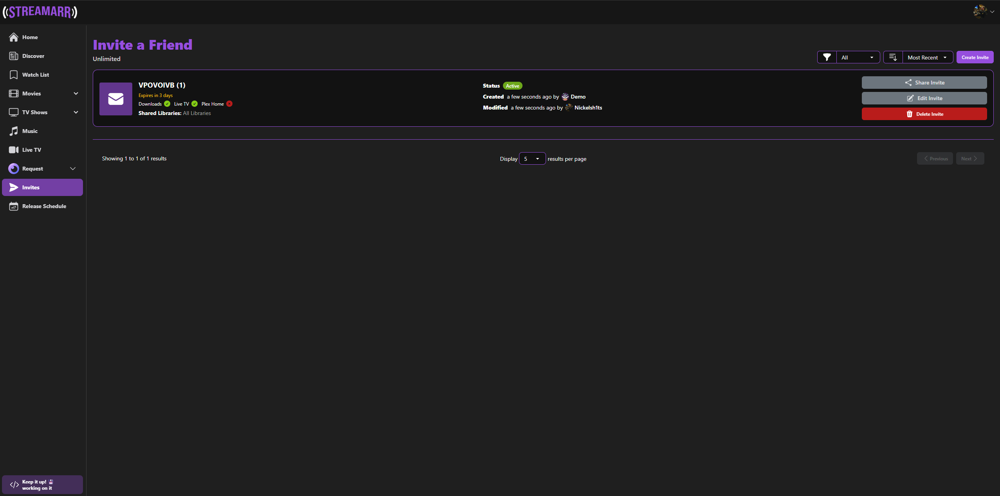
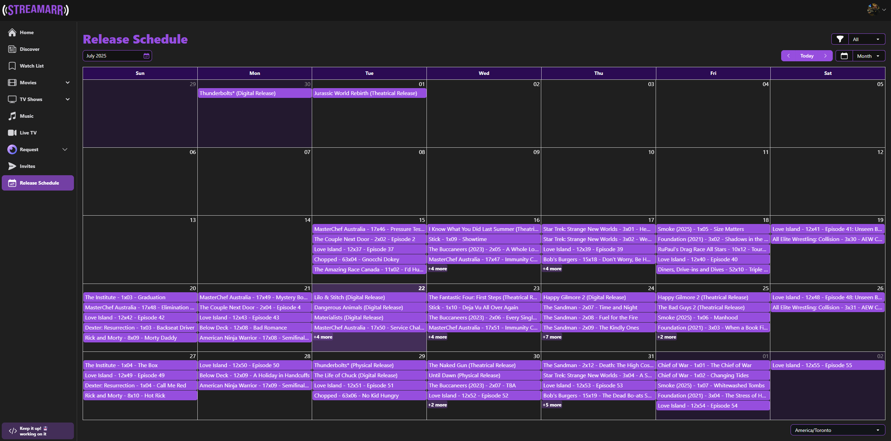

> 🚧 **Under Active Development:** I'm excited to bring this project to life, but note that it is unfinished in it's current state and some things may be broken or not fully implemented.
>   

**Streamarr** is a an open source web application meant to wrap an existing \*Arr ecosystem such as **[Sonarr](https://sonarr.tv/)**, **[Radarr](https://radarr.video/)**, **[Overserr](https://overseerr.dev/)**, and **[Plex](https://www.plex.tv/)** enabling a smooth user friendly experience.

## Overview

Currently under active development Streamarr aims to be a complete (or at least semi-complete) web application for those who heavily manage a plex server with various *Arr applications and many users. Featuring a full front end to make accessing both streaming and backend *Arr services easy and straightforward. Integrating with Overseerr to manage requests and a fully featured invite system to make end user experiences a breeze.

---

## Major Features

- Admin Centre for easy to manage settings and users.
- A robust and customizable invite management system.
- A fully featured release schedule with integrations to Sonarr and Radarr.
- Integrated with Overseerr for a complete user experience for streaming, requesting and reporting issues.
- A fully customizable user permission system.
- Built as a PWA so users can access on-the-go or on a PC.
- Supports most\* Plex library types: Movies, TV Shows, Music and live TV.
- An integrated Help Center for clear user instructions and support.

## Planned Features

- An integrated notification system with custom notification triggers.
- Enable Customization of the Help Center.
- Fully customizable email newsletters and communications.
- Theme and Logo customization.

With more features planned!

## Getting Started

As I am still actively developing I have not yet created docs, but once available, you can visit the below link.

https://docs.streamarr.dev

## Support

- Check out our [documentation](https://docs.streamarr.dev) before asking for help. The answer might also be in our [issue tracker](https://github.com/nickelsh1ts/streamarr/issues).
- You can reach out to us on the [GitHub Discussions](https://github.com/nickelsh1ts/streamarr/discussions).
- Bug reports and feature requests can be submitted with [GitHub Issues](https://github.com/nickelsh1ts/streamarr/issues).

## API Documentation

You can access the API documentation from your local Streamarr install at http://localhost:3000/api-docs

## Contributors

<!-- ALL-CONTRIBUTORS-LIST:START - Do not remove or modify this section -->
<!-- prettier-ignore-start -->
<!-- markdownlint-disable -->
<table>
  <tbody>
    <tr>
      <td align="center" valign="top" width="14.28%"><a href="https://nickelsh1ts.com"> <b>nickelsh1ts</b></a> <a href="https://github.com/nickelsh1ts/streamarr/commits?author=nickelsh1ts" title="Code">💻</a> <a href="#design-nickelsh1ts" title="Design">🎨</a> <a href="#ideas-nickelsh1ts" title="Ideas, Planning, & Feedback">🤔</a> <a href="https://github.com/nickelsh1ts/streamarr/commits?author=nickelsh1ts" title="Tests">⚠️</a></td>
    </tr>
  </tbody>
</table>
<!-- markdownlint-restore -->
<!-- prettier-ignore-end -->

<!-- ALL-CONTRIBUTORS-LIST:END -->

## Screenshots

