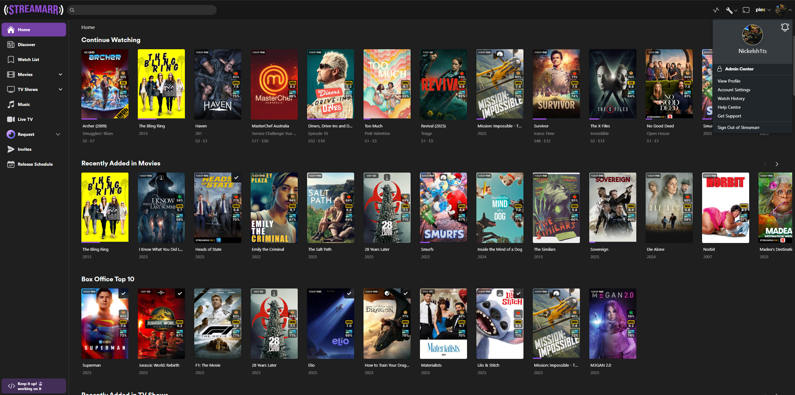
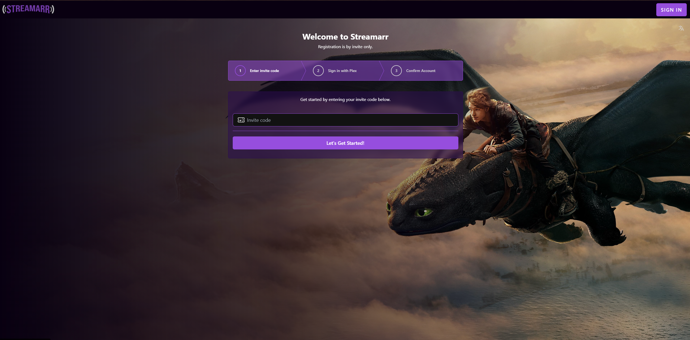
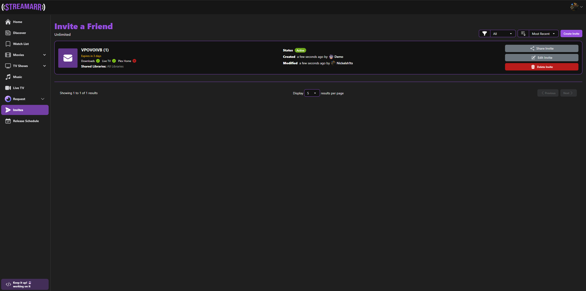
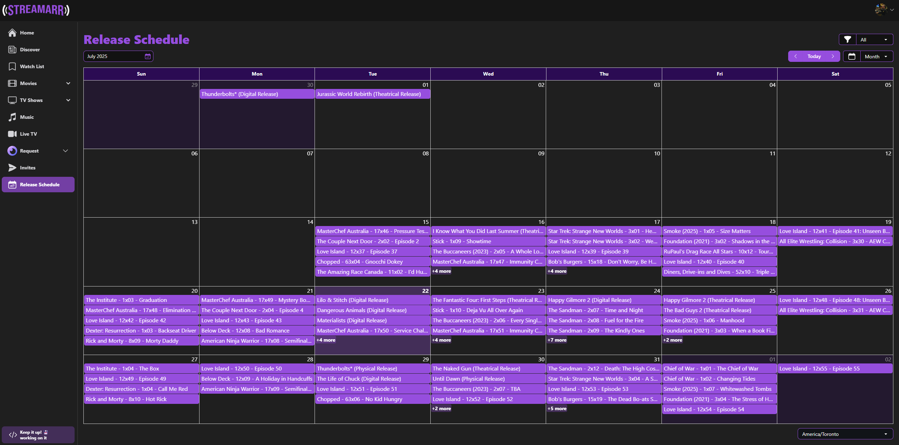

**Streamarr** is an open source web application meant to wrap an existing \*Arr ecosystem such as **[Sonarr](https://sonarr.tv/)**, **[Radarr](https://radarr.video/)**, **[Overseerr](https://overseerr.dev/)**, and **[Plex](https://www.plex.tv/)** enabling a smooth user friendly experience.

## Overview

Streamarr provides a unified dashboard for managing your Plex server alongside your \*Arr ecosystem. It simplifies common tasks like inviting users to Plex, tracking upcoming releases, monitoring downloads, and proxying access to your backend services—all from a single, polished interface designed for both administrators and end users.

---

## Major Features

- **Full Plex Integration** — Sign in with Plex, embedded Plex Web player, user management
- **Robust Invite System** — Usage limits, expiry dates, library access controls, QR codes
- **Release Calendar** — Upcoming releases from Sonarr and Radarr, plus custom events
- **\*Arr Service Integration** — Connect Radarr, Sonarr, Lidarr, Prowlarr, Bazarr, Tdarr, and more
- **Download Client Management** — Monitor and manage qBittorrent, Deluge, and Transmission with health monitoring
- **Flexible Notifications** — Email (with PGP encryption), Web Push, and In-App notifications
- **Internal Service Proxy** — Securely access embedded \*Arr services through Streamarr
- **Granular Permissions** — 15+ permission types for fine-grained access control
- **Trial Periods** — Optionally restrict new users during a configurable trial period
- **Custom Theming** — Fully customize 20 color tokens and logos to match your brand
- **System Health & Restart** — Real-time health monitoring for server and Plex Sync service with in-app restart controls
- **Status Page Integration** — Link to Uptime Kuma or any external status page
- **PWA Support** — Install as a Progressive Web App on mobile devices
- **Multi-language Support** — Localized interface
- **Interactive Onboarding** — Welcome modals and interactive tutorials for both users and administrators
- **Help Centre** — Comprehensive help and support resources

## Planned Features

- **Jellyfin Support** — Dual-backend support for both Plex and Jellyfin users
- **Email Newsletters** — Customizable email newsletters and communications
- **Additional Services** — Cleanuparr, Nexroll and Kometa integrations
- **Invite Duration** — Time-limited invite codes that expire after a set period
- **Activity Centre** — Centralized feed of user activity, requests, and system events
- **Notification Overhaul** — More notification channels, templates, and user preferences

## Getting Started

Check out our documentation for installation instructions and configuration guides:

https://docs.streamarr.dev

## Support

- Check out our [documentation](https://docs.streamarr.dev) before asking for help. The answer might also be in our [issue tracker](https://github.com/nickelsh1ts/streamarr/issues).
- You can reach out to us on the [GitHub Discussions](https://github.com/nickelsh1ts/streamarr/discussions).
- Bug reports and feature requests can be submitted with [GitHub Issues](https://github.com/nickelsh1ts/streamarr/issues).

## API Documentation

You can access the API documentation from your local Streamarr install at http://localhost:3000/api-docs

## Note on AI use

As a note of transparency, I felt it necessary to disclose the current nature in which this project makes use of AI. While most of the code in this project has been written by a human, Claude and Copilot have been used primarily for Docs generation and code review, as well as for research, brainstorming, and code suggestions to fill gaps in knowledge. Any code generated by AI has been re-written by a human, reviewed, tested and verified before being published. The use of AI in this project is meant to assist and augment human creativity and productivity, not replace it. I am committed to ensuring that all code in this project is of high quality, maintainable, and properly attributed regardless of its origin.

## Contributors

<!-- ALL-CONTRIBUTORS-LIST:START - Do not remove or modify this section -->
<!-- prettier-ignore-start -->
<!-- markdownlint-disable -->
<table>
  <tbody>
    <tr>
      <td align="center" valign="top" width="14.28%"><a href="https://nickelsh1ts.com"> <b>nickelsh1ts</b></a> <a href="https://github.com/nickelsh1ts/streamarr/commits?author=nickelsh1ts" title="Code">💻</a> <a href="#design-nickelsh1ts" title="Design">🎨</a> <a href="#ideas-nickelsh1ts" title="Ideas, Planning, & Feedback">🤔</a> <a href="https://github.com/nickelsh1ts/streamarr/commits?author=nickelsh1ts" title="Tests">⚠️</a></td>
    </tr>
  </tbody>
</table>
<!-- markdownlint-restore -->
<!-- prettier-ignore-end -->

<!-- ALL-CONTRIBUTORS-LIST:END -->

## Screenshots

